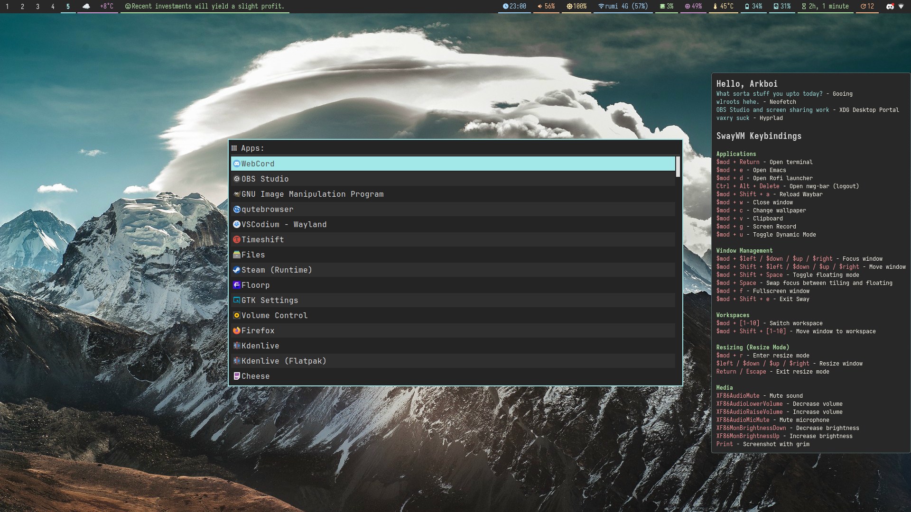

<h1>✨ ARKBOI'S SWAY ✨</h1>

These are my SwayWM Configuration files. I use these with Arco Linux, but it is compatible with any Arch based distrubution.

## 🥭 Notable Features 🥭

- Pastel TTY colors.
- Changing Colors are easy!
- Rofi app launcher
- Simple designs
- Keybindings widget
- Waybar as top bar
- Emacs support

## Screenshot

Main Branch (*Grimy Grove*)




## 🏔️ Installation 🏔️

0- Install packages

``` shell
sudo pacman -S sway waybar rofi-wayland mako kitty nwg-bar fortune-mod swayidle xdg-desktop-portal xdg-desktop-portal-wlr
```

1 - Clone the repository:

``` shell
git clone --depth 1 https://github.com/arkboix/sway.git 
```
2- Remove existing config if they exist
``` shell
rm -rf ~/.config/sway ~/.config/waybar ~/.config/rofi ~/.config/kitty ~/.config/mako ~/.config/nwg-wrapper
```
3- Copy files over
``` shell
cp ~/sway/files/.config/* ~/.config
````

This should be it for the installation.

